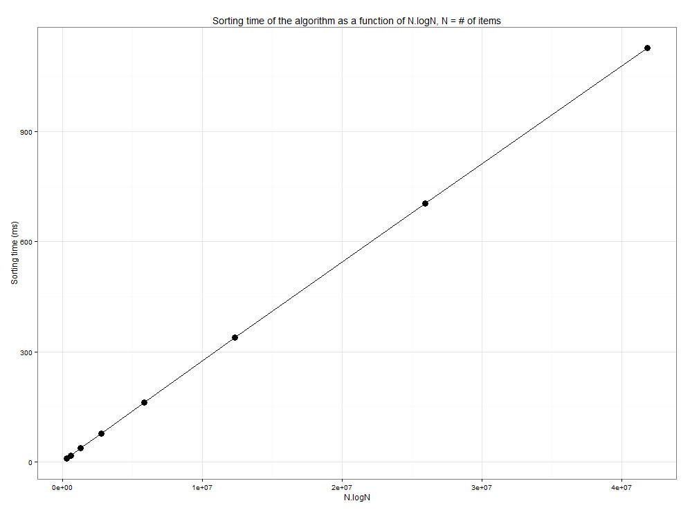

# MergeSort

A simple recursive implementation of the famous merge sort.
Can (I didn't say should...) be used to sort any object that implements comparison operators.
 
The implementation requires C++11.

The code inside main.cpp was used to test the time complexity of the algorithm. The plot below shows the results obtained as Sorting vs N.log2(N), where N is the size of the input array. In the tests, the numbers were random.

We can see that our algorithm follows perfectly the theoretical O(NlogN) performance.
